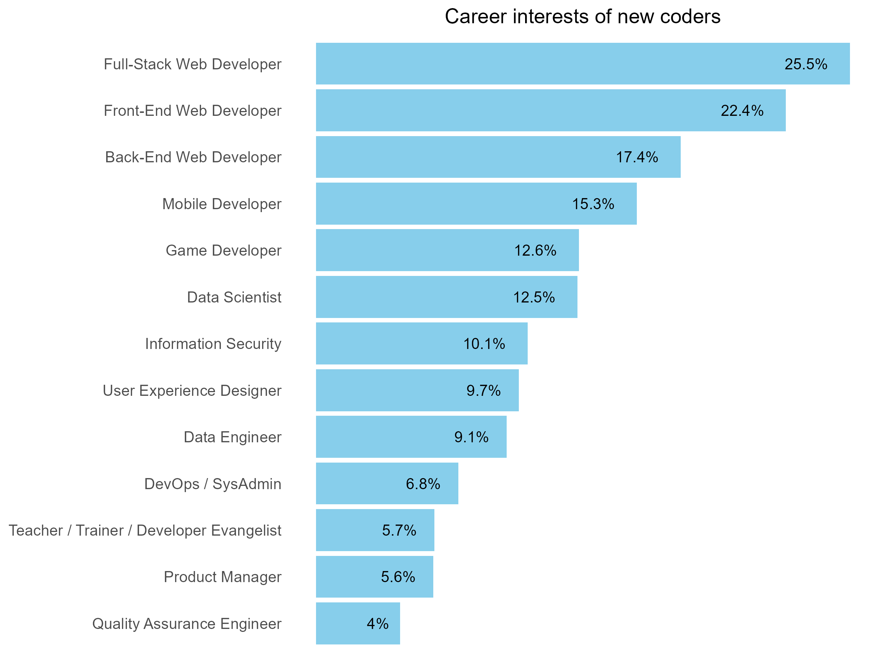
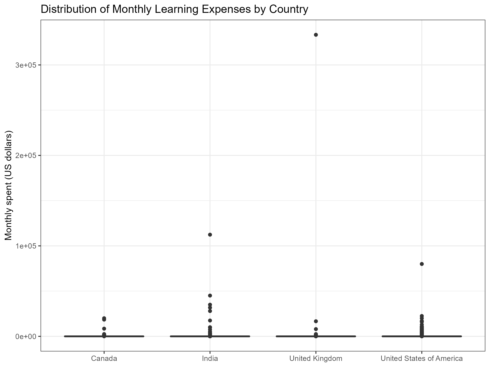
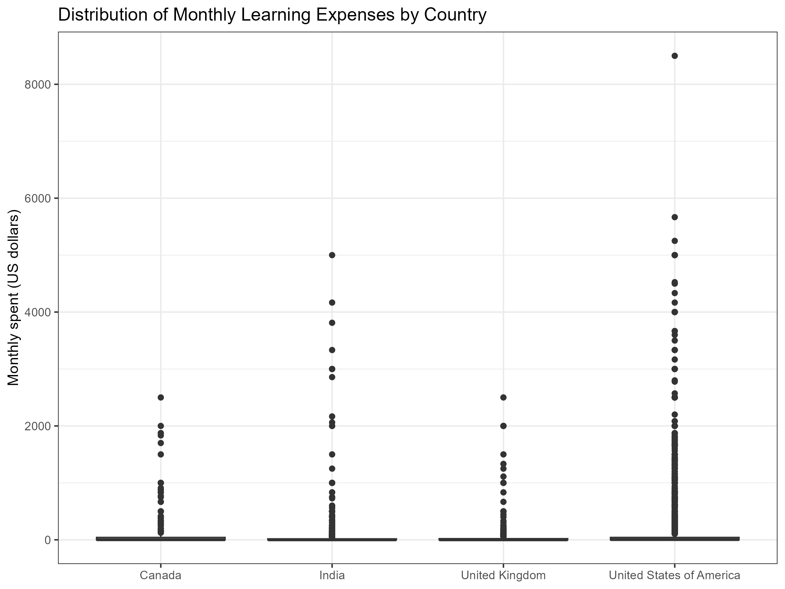

# New Coders Market Analysis

## Overview
This project aims to identify the optimal market to advertise programming courses, using the open dataset from the **2018 freeCodeCamp new coder survey** by identifying these three factors:
1. Specific **career paths** that new coders are interested in, such as web and mobile development and data science
2. **Location densities** of new coders to identify countries with high demand for programming resources
3. **Amount of money new coders are prepared to spend** in learning to code

## Data Source
- **Source**: Open dataset from [freeCodeCamp's 2018 survey](https://github.com/freeCodeCamp/2018-new-coder-survey/blob/master/raw-data/2018-new-coder-survey.csv)
- Contains 31,226 rows and 136 columns

## Tech Stack
- **R**: The primary language for data manipulation and analysis.
- **Tidyverse**: A collection of R packages (including dplyr and ggplot2) used for data wrangling and visualization.
- **readr**: For fast reading of large datasets in .csv format.

Make sure you have the required packages installed before running the scripts:
```r
install.packages(c("readr", "tidyverse", "tools"))
```

## Data Preparation
Before conducting any analysis, we need to clean the raw data using the ```survey-data-cleanup.R``` script which performs the following:
- Renaming columns for better readability.
- Filtering out invalid or inconsistent responses (e.g., age discrepancies, unreasonable income values, invalid child information).
- Converting boolean responses and handling "Other" text fields by formatting them in title case.

To run ```survey-data-cleanup.R```:
```r
# Ensure the dataset file is named '2018-new-coder-survey.csv' in the working directory.
source("survey-data-cleanup.R")
```
After running the script, the cleaned dataset will be saved as ```cleaned-coder-survey.csv``` with 30,992 rows. Here's a brief snippet of the rename function:
```r
data %>%
  rename(
    id = "#",
    is_softdev = "Are you already working as a software developer?",
    ...
    num_children = "How many children do you have?",
    ...
    ts_start = "Start Date (UTC)",
    ts_end = "Submit Date (UTC)"
  )
```
## Data Analysis
Use the ```survey-data-analysis.R``` script to analyze the cleaned dataset.

### Career Interests
**Question:** Which careers are new coders interested in?

**Code snippet:**
```r
# Define function to calculate percentage for specified columns
calculate_percentage <- function(data, prefix) {
  data %>%
    summarise(across(starts_with(prefix) & !contains("_other"), ~ sum(. == 1, na.rm = TRUE) / n())) %>%
    pivot_longer(cols = everything(), names_to = "column", values_to = "percentage")
}
career_intrst <- calculate_percentage(coder_survey, "career_")
```


Primary areas of interest among participants are **web and mobile development**, which account for **15% to 25%** of the responses. Notably, many participants indicated interest in multiple niches. However, the majority are still uncertain about their specific career aspirations. We excluded rows with no answers in these columns to ensure we were working with a representative sample.

### Location Density
**Question:** Where do the new coders currently live?

**Code snippet:**
```loc_density <- filtered_df %>%
  group_by(residence) %>%
  summarise(
    `Absolute frequency` = n(),
    `Percentage` = n() * 100 / nrow(filtered_df)
  ) %>%
  arrange(desc(Percentage))
```
The top ten countries are:
1. United States of America: 35.96%
2. India: 14.31%
3. United Kingdom: 4.07%
4. Canada: 2.91%
5. Nigeria: 2.20%
6. Brazil: 2.021%
7. Germany: 1.88%
8. Russia: 1.80%
9. Spain: 1.25%
10. Poland: 1.23%

Since the programming courses we offer are in English, we will focus on participants from English-speaking countries.

We filtered for those residing in the **United States, India, the United Kingdom, and Canada**.

### Spending analysis
**Question:** How much are these new coders willing to spend in programming resources?
**Code snippet:**
```r
# Since the amounts provided for monthly spending vary significantly, we first examined the distribution of these values
ggplot(top4_df, aes(x = residence, y = monthly_spent)) +
  geom_boxplot() +
  ggtitle("Monthly spent for learning per country (Distributions)") +
  xlab("Country") +
  ylab("Monthly spent (US dollars)") +
  theme_bw()
```


### Outlier Detection
Significant outliers were detected in the spending distribution:
- Several respondents reported monthly learning expenditures exceeding $20,000.
- In Canada, one respondent who did not attend a boot camp reported spending $8,500 each month, while another attended a boot camp but spent $18,500 monthly. Both individuals indicated they had been coding for one month or less at the time of the survey, suggesting that their reported spending is unrealistic and likely should be much lower.
- Similar instances were observed in the UK, where one individual spent over $16,000 per month for three months without attending any boot camp. Another respondent attended a boot camp but had only been programming for one month or less, yet reported spending $8,000 monthly.
- In India, all six identified outliers did not attend any boot camp. Notably, four of these respondents claimed to spend $10,000 or more per month on programming resources, despite having only learned to code for less than four months. This discrepancy may indicate a misinterpretation of the actual survey question "Aside from university tuition, how much money have you spent on learning to code so far (in US dollars)?"
- In US, 15 respondents either did not attend a boot camp or had been coding for three months or less while spending $6,000 or more per month. Consequently, we will also exclude participants from the US who meet these criteria.

These outliers were then removed.

**Code snippet:**
```r
us_outlier <- top4_df %>%
  filter(
    residence == "United States of America",
    monthly_spent >= 6000,
    months_code <= 3 | bootcamp_attend != 1
  )

top4_df  <-  top4_df %>% 
  filter(!(index %in% us_outlier$index))
```


### Summary Statistics
```r
mean_per_country <- top4_df %>% 
  group_by(residence) %>%
  summarize(mean = mean(monthly_spent)) %>%
  arrange(desc(mean))
```
After filtering outliers, the average monthly expenditure on programming resources is:
- United States: $136
- Canada: $104
- United Kingdom: $63.5
- India: $62.3

However, India, with a much larger number of new coders (14.31%), represents a potentially vast untapped market, despite its lower average spending.

## Actionable Recommendations:
- **Focus advertising campaigns in the U.S.** where the willingness to spend and number of new coders is highest.
- **Explore secondary markets** such as **Canada** and **India**. In India, although average spending is lower, the large population of new coders can drive significant volume in course sales, especially with affordable pricing options.
- **Offer flexible pricing strategies** to accommodate the different spending behaviors across countries. For example, premium courses for U.S. and Canada, while offering budget-friendly options in India and the UK.
